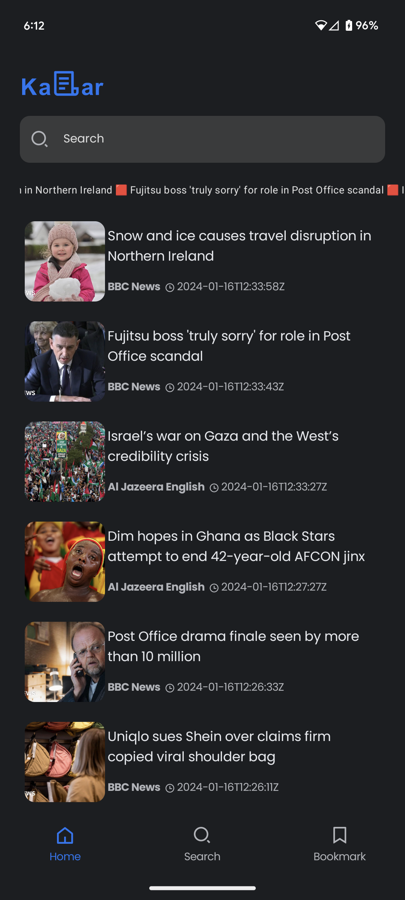

# News App README

## Overview

Welcome to the News App! This application provides a seamless and engaging experience for users to stay informed about a variety of news articles and stories from around the world.

## Features

- **Explore Diverse News:** Stay informed with a variety of news articles covering a range of topics and experiences.

- **Read Worthy Stories:** Discover read-worthy stories from around the world through our intuitive News App.

- **Latest Updates at Your Fingertips:** Get the latest news updates at your fingertips, providing you with a seamless and engaging reading experience.

## Getting Started

To get started with the News App, follow these steps:

1. **Installation:** Download and install the News App on your device.

2. **Explore News:** Open the app and explore the diverse range of news articles available.

3. **Read and Share:** Enjoy reading read-worthy stories and easily share them with your friends and family.

## Requirements

- Android version 5.1.1 or higher

## Contact

If you have any questions or feedback, feel free to reach out to us at [divyanshbarar@gmail.com](mailto:divyanshbarar@gmail.com).

Happy reading!
